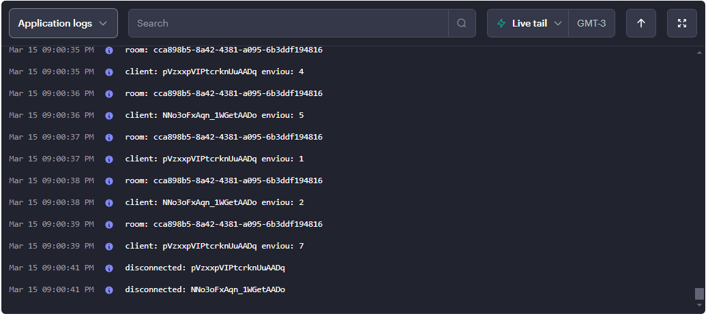

# Tic Tac Toe Server
Código do backend para o jogo [Tic Tac Toe Multiplayer](https://github.com/Alex5ander/tic-tac-toe-multiplayer) desenvolvido em Node JS e utilizando 
[Socket.io](https://socket.io/).

## Logs do servidor em produção


## Passos para rodar esse projeto


### Clone este repositório

```
git clone https://github.com/Alex5ander/tic-tac-toe-multiplayer-server.git
```

### Instale as dependências

```
npm i
```

### Executar em modo de desenvolvimento

```
npm run dev
```

### Executar em modo de produção

```
npm run start
```